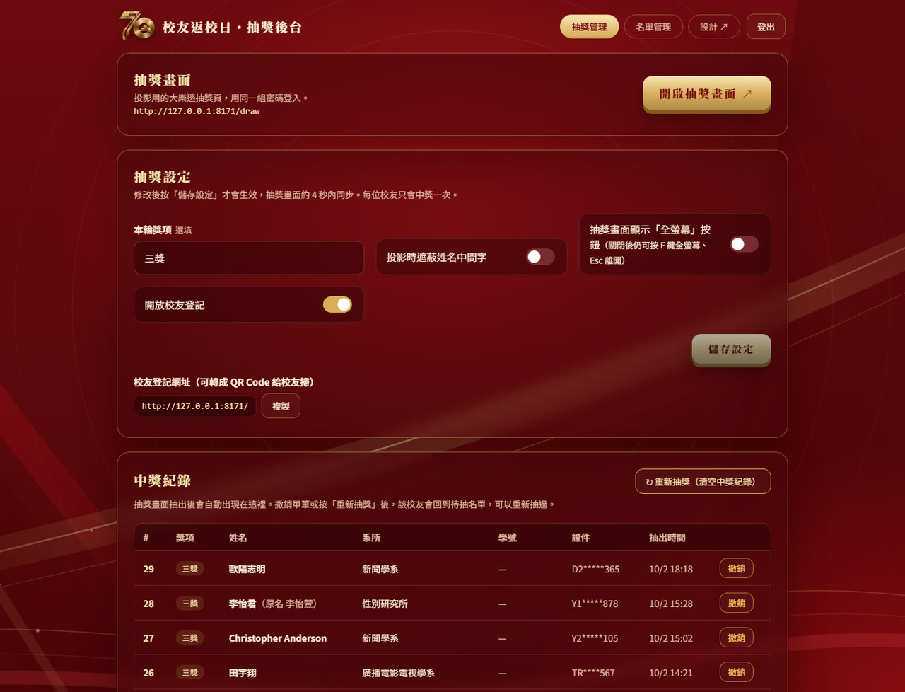

# 世新校友抽獎系統

校友名冊報到 ＋ 大樂透風格的現場抽獎系統。視覺採用世新大學 70 週年紅金主視覺。

名冊事先從 Excel 匯入，校友到場後輸入**身分證字號＋姓名**完成報到，只有報到過的人會進抽獎池。

零相依套件，只要有 Node.js 就能跑；資料存在本機單一 JSON 檔，整個資料夾複製走就能搬家。
適合校友回娘家、系友會、尾牙等需要「先報名、現場投影抽獎」的場合。


*抽獎畫面 `/draw`：中獎者的系所先出現，3 秒後姓名以超大字一個字一個字落下，背景持續灑彩帶。
版面、文案、顏色、圖片、動畫秒數全部可在 `/design` 後台調整，不需要改程式。*

```
事先匯入校友名冊 → 校友掃 QR Code → 輸入身分證字號＋姓名報到 → 投影抽獎畫面 → 按下開始抽獎
→ 彩球從畫面外彈跳進場 → 快轉攪拌 → 減速 → 中獎球滾出
→ 畫面中上方先出現系所 → 3 秒後姓名一個字一個字出現
→ 姓名右下角小字顯示遮罩後的身分證字號（A1*****789）給本人核對
   （只有投影的抽獎畫面會遮罩；後台要密碼才進得去，顯示完整號碼）
```

---

## 目錄

- [畫面介紹](#畫面介紹)
- [四個頁面](#四個頁面)
- [快速開始](#快速開始)
- [活動當天的流程](#活動當天的流程)
- [後台功能](#後台功能)
- [設計後台](#設計後台)
- [對外開放（Cloudflare 臨時網址）](#對外開放cloudflare-臨時網址)
- [資料與備份](#資料與備份)
- [個資與安全](#個資與安全)
- [環境變數](#環境變數)
- [API 一覽](#api-一覽)
- [檔案結構](#檔案結構)
- [常見問題](#常見問題)
- [更新紀錄](#更新紀錄)

---

## 更新紀錄

### 2026/10/07
- 抽獎揭曉畫面右下角的**遮罩身分證字號放大兩倍**，位置下移到與按鈕同高。
- 設計後台的身分證字號**大小與位置改成拉條**（原本要自己填 `clamp()`），左右拉即時預覽。
- 後台版面放寬到 1680px，**中獎紀錄不用再左右捲**就看得到全部欄位。
- 「↻ 重新抽獎（清空中獎紀錄）」按鈕改名為**「清空中獎紀錄」**，確認視窗文字一併改寫，並修正原本誤用名冊總人數的說明。

### 2026/10/06
- **承載度修正**：原本流量限制算在 IP 上，現場共用 Wi-Fi 時 1000 人報到只有 150 人成功。改成以身分證號為單位（同一號碼每分鐘 12 次，仍擋得住猜姓名），另加一個很寬的整體上限。
- 寫檔從「每人報到就整份重寫 1 MB」改成 **200 毫秒合併寫一次**，並新增**報到日誌**（`data/checkin-journal.log`）：報到當下先 append 一行，db.json 寫成功後清空；強制關機或斷電時下次啟動自動補回。
- 伺服器穩定性：連線佇列 2048、請求逾時回收、未攔截例外不中斷服務、流量計數與登入權杖定時清理，並新增 **`伺服器-自動重開.bat`**（意外結束 3 秒後自動重啟）。
- 實測：2667 人同時報到 1.2 秒完成零失敗；1000 條連線同時送出零失敗；模擬斷電後資料一筆不少。
- 新增**「查無身分證號也顯示已完成登記」開關**（預設關閉）：開啟後亂輸入的號碼照樣顯示完成，但不寫入名單、不參加抽獎；號碼正確而姓名不符仍會擋下。後台顯示放行次數（不含個資）。
- 登記完成畫面簡化為只留圖示與標題，標題統一為「已完成登記」，可在設計後台修改。
- 開場彈跳球取消擠壓變形，改成正圓球體彈跳。

### 2026/10/05
- 匯入正式校友名冊 **2667 筆**（身分證號、姓名、班級、電話、Email），清掉原本的測試名單與中獎紀錄。
- **報到方式改版**：只填身分證字號＋姓名，與名冊核對。姓名不符顯示「姓名有誤」、查無號碼顯示「查無此身分證號」、重複報到顯示「已完成登記」，**只有報到過的人會被抽到**。
- 中獎畫面的系所改為顯示班級簡稱（例：圖傳四甲），不再出現「學士班」「應畢109年」。
- 後台新增**「報名名單」分頁**（報到完成的人）：報到順序、報到時間到秒、單筆取消報名、編輯、匯出報名名單 CSV、一鍵清除全部報名紀錄（名冊保留）。
- 後台名單欄位改為**完整顯示身分證字號、電話、Email**（後台需密碼登入），只有投影的抽獎畫面遮罩。
- 修正匯入名冊中 250 筆舊式／非標準證號無法在後台編輯的問題。

---

## 四個頁面

| 路徑 | 用途 | 需要密碼 |
|---|---|:--:|
| `/` | **校友報到頁**。只填身分證字號＋姓名，和匯入的名冊比對 | 否 |
| `/draw` | **抽獎畫面**。投影用，彩球慢速攪拌後掉出中獎球，畫面中上方先顯示系所、3 秒後姓名超大字一個字一個字出現 | 是 |
| `/admin` | **後台**。抽獎設定、中獎紀錄、名單管理、匯出 CSV | 是 |
| `/admin?tab=reg` | 後台**直接開在報名名單**（報到完成的人）。「抽獎管理」頁有這條連結可以複製 | 是 |
| `/admin?tab=list` | 後台**直接開在校友名冊**（匯入的完整名冊） | 是 |
| `/design` | **設計後台**。改前台的顏色、字型、尺寸、所有文字，也能寫自訂 CSS，右側即時預覽 | 是 |

三個管理頁使用同一組管理密碼。後台與抽獎畫面共用登入（12 小時內有效）；**設計後台需要另外登入**，2 小時後自動登出。

抽獎畫面**不放「後台管理」「登出」按鈕**——投影時誤觸會把畫面切走或登出。要進後台請直接開 `/admin`。右上角的「全螢幕」按鈕**預設也是隱藏的**，可在後台「抽獎設定」打開。

### 抽獎畫面的鍵盤快捷鍵

| 按鍵 | 功能 |
|---|---|
| **空白鍵／Enter／→／PageDown** | 開始抽獎。一般簡報筆的「下一頁」送的就是這幾個鍵，可以站在台上用簡報筆控場 |
| **F** | 全螢幕開關（`Esc` 也可離開） |
| **M** | 音效開關，畫面會短暫顯示目前狀態 |
| **Q 或 A** | 切換到另一場（校友場 ⇄ 在校生場） |

- 抽獎進行中按鍵無效，不會重複抽；在登入密碼欄位打字時不會被攔截。
- 判斷同時看 `e.code` 與 `e.key`，因為部分簡報筆與遠端桌面送出的事件 `e.key` 是空字串。
- Q／A 切換會自動判斷：用本機位址時切對方的本機位址，用 Cloudflare 臨時網址時向伺服器要對方**當下**的臨時網址（臨時網址每次重開都會變，寫死會失效）。

---

## 畫面介紹

### 校友登記頁 `/`


*校友掃 QR Code 進來報到，只要填身分證字號與姓名，系統拿去和匯入的名冊比對：*

| 比對結果 | 畫面 |
|---|---|
| 號碼與姓名都對 | 「登記完成」，列入抽獎名單 |
| 同一個人再送一次 | 「您已完成登記」，不會重複建資料 |
| 號碼對、姓名不符 | 「姓名有誤，請確認與校友名冊上的姓名一致。」 |
| 名冊裡沒有這個號碼 | 「查無此身分證號，請確認輸入是否正確，或洽現場服務台。」 |

*比對前會自動轉大寫、去掉空白與連字號，姓名會去掉空白並把「臺」視同「台」。*

### 抽獎畫面 `/draw`


*投影用。球槽預設裝滿 32 顆彩球，中央是 70 週年 Logo。按下「開始抽獎」後會先有一顆球從畫面外彈跳進場，
跳進抽獎機才開始攪拌。*

### 抽獎揭曉


*抽獎機變暗，畫面中上方先出現「恭喜抽中」與系所，3 秒後姓名逐字落下，中獎畫面持續灑彩帶。*

### 後台 `/admin`



*抽獎設定、中獎紀錄、名單管理都在這裡。證件號碼一律遮蔽顯示，只有匯出 CSV 才會有完整號碼。*

### 設計後台 `/design`


*左側修改、右側即時預覽。配色、抽獎機、抽獎畫面、圖片與 Logo、字型、所有文案都能改，不需要動程式。*

---

## 快速開始

需求：[Node.js](https://nodejs.org/) 20 以上（開發環境為 24）。不需要 npm install。

```bash
node server.js
```

啟動後：

- 網站在 http://localhost:8123
- 首次啟動會自動產生管理密碼，寫在 `admin-password.txt`，終端機也會印出來
- 資料庫檔 `data/db.json` 會在第一筆登記時自動建立

Windows 可以直接雙擊 **`啟動.bat`**，它會啟動伺服器，並開一條 Cloudflare 臨時通道，讓校友從外部連得進來。

---

## 活動當天的流程

0. **事先匯入名冊**：把校友名冊（身分證號、姓名、班級、電話、Email）寫進 `data/db.json` 的 `entries`，每個人 `registered: false`。匯入後先按後台的「全部改為未登記」把測試報到資料清掉。
1. **開放報到**：把 `/` 的網址做成 QR Code 發給校友。後台「抽獎設定」的「開放校友登記」要保持開啟。
2. **截止報到**：抽獎開始前把該開關關掉，前台就會顯示「登記已截止」。
3. **投影**：另一台電腦（或同一台的另一個分頁）開 `/draw`，登入後按 **F 鍵**全螢幕（或先到後台把「全螢幕」按鈕打開）。
   - 抽獎畫面是一塊**固定 4096 × 2048（2:1）的版面**，整塊等比例縮放去貼合實際螢幕，所以構圖在 LED 牆、投影機、筆電上完全一樣，不會因為螢幕寬高比不同而跑版。版面尺寸可在設計後台 `/design` →「抽獎畫面」的**版面寬度／高度**修改（例如改成 `1920px` × `1080px` 配一般投影機）。
   - 縮放取「填滿螢幕」與「安全範圍完整可見」兩者的小值：版面四周留白（上下 5%、左右 7%）允許被裁掉，所以一般 16:9 筆電是**完全滿版、沒有黑邊**，又不會切到「恭喜抽中」和按鈕；螢幕比例和版面差太多（例如直立）才會留邊。
   - 頂端列高度由 JS 量測後寫進 `--topbar-h`（不可寫死，之前寫死 90px 但實際只有 66px，會多出空白條並擠出捲軸）。
   - **版面本身不要畫背景**，讓整頁的底圖（`theme.css` 的 `body::before`）透上來，header 和抽獎區才是同一張背景、不會在 header 下方出現接縫，裝飾圖的取景也和其他頁一致。只有全螢幕時舞台蓋住整個畫面、看不到 body，才由 `.stage:fullscreen` 自己補一份背景。
   - 版面裡的字級與間距都以這塊版面為基準，所以 `/design` 裡填的 px 就是 LED 牆上的實際像素（例如中獎姓名預設最大 555px）。
4. **抽獎**：按「開始抽獎」（或空白鍵／簡報筆），依序是：

   | 階段 | 預設秒數 |
   |---|---|
   | 彩球從畫面外彈跳三次後飛進抽獎機 | 3.4 秒 |
   | 快轉攪拌 | 4 秒 |
   | 減速 | 3.2 秒 |
   | 中獎球慢慢滾出來 | 2.6 秒 |
   | 「恭喜抽中」＋**系所**出現（同名時靠系所區分，沒填系所顯示「（未填系所）」） | — |
   | 等待後**姓先出現**，再過 3 秒出名字，逐字落下（每字 0.65 秒） | — |

   每個字都有光芒爆開，中獎畫面持續灑彩帶。「開始抽獎」按鈕在揭曉時移到畫面最下方，按下就進入下一輪。
   所有秒數都能在 `/design` →「抽獎畫面」調整。
   - 中獎者由伺服器以 `crypto.randomInt` 決定，前端只負責播動畫。
   - 每位校友最多中獎一次，抽過的人不會再進入待抽名單。
5. **記錄**：中獎名單即時出現在 `/admin` 的「中獎紀錄」，抽錯可單筆「撤銷」。
6. **收尾**：後台「匯出 CSV（含完整證件號）」下載得獎與報名名單，用 Excel 開啟核對身分。

想分頭獎、二獎，就在後台「本輪獎項」填入名稱再按「儲存設定」，該輪抽出的人會記在中獎紀錄裡。這個欄位是選填，留空代表不標獎項，抽獎畫面本身不會顯示獎項。

---

## 後台功能

### 抽獎設定

| 項目 | 說明 |
|---|---|
| 本輪獎項 | 選填。填了會記在中獎紀錄與 CSV，抽獎畫面不顯示 |
| 投影時遮蔽姓名中間字 | 開啟後中獎姓名顯示為「王○明」，適合公開場合 |
| 開放校友登記 | 關閉後前台顯示「登記已截止」，`/api/register` 一併擋掉 |
| 抽獎畫面顯示「全螢幕」按鈕 | **預設關閉**，避免投影時誤觸。關閉後仍可按 F 鍵全螢幕、Esc 離開 |

改完要按 **「儲存設定」** 才生效，抽獎畫面約 4 秒內同步。未儲存時頁面的自動更新不會蓋掉正在編輯的內容，離開頁面會有提醒。

### 中獎紀錄

- 抽獎畫面抽出的人會自動出現（後台每 5 秒更新）。
- **撤銷**：單筆移除，該校友回到待抽名單。
- **↻ 重新抽獎（清空中獎紀錄）**：清空全部中獎紀錄，所有人回到待抽名單，可以整場重抽。名單本身不會被刪。

### 報名名單

只列報到完成的人，照報到時間排序，是實際的抽獎池。

- 統計：報名完成、已中獎、待抽、最後一筆報到時間。
- 欄位：報到順序、編號、姓名、**身分證字號（完整）**、電話、Email、系所、班級、報到時間（到秒）、狀態。
- 搜尋姓名、系所、班級、電話、Email、編號；人多時先顯示最近報到的 500 筆。
- **取消報名**：把單一個人移出報名名單（報到按錯人時用），名冊資料保留，之後可以再報到一次。已中獎的要先撤銷中獎紀錄。
- **編輯**：直接改這個人的資料。
- **匯出報名名單 CSV**：只含報到完成的人，照報到時間排序。
- **清除全部報名紀錄**：所有人改回未報到、清掉報到時間，中獎紀錄一併清空；校友名冊完整保留。

### 校友名冊

- 統計：名冊人數、已登記（報到）、已中獎、待抽。
- 欄位：編號、姓名、**身分證字號（完整）**、電話、Email、系所（抽獎畫面顯示的班級簡稱）、班級（名冊原始資料）、登記時間、狀態。
- 篩選：全部／已登記／未登記；搜尋姓名、系所、班級、電話、Email、編號。名冊很大時表格先顯示前 500 筆，用搜尋縮小範圍。
- **＋ 新增校友**：現場臨時補登。會標記「後台補登」並直接視為已登記，一樣參加抽獎。
- **編輯**：可改姓名、系所、班級、電話、Email、證件號碼。改完中獎紀錄與 CSV 會同步更新。
  匯入的名冊裡有舊式、居留證、外籍等非標準號碼，只要號碼沒動就不會被格式檢查擋住；真的要改成非標準號碼，會先跳出確認再存。
- **取消登記**：把單一個人改回未登記、清掉登記時間（報到按錯人時用）。已中獎的要先到「中獎紀錄」撤銷那一筆。
- **刪除**：單筆刪除。
- **全部改為未登記**：名冊完整保留，只把所有人改回未登記、清空中獎紀錄。活動前清掉測試報到資料時用。
- **清空名單**：連名冊一起刪除，會連續確認兩次，之後要重新匯入。
- **匯出 CSV**：UTF-8 with BOM，Excel 直接開。欄位為編號、身分證號、姓名、系所、班級、電話、Email、是否已登記、登記時間、來源、中獎獎項、抽出時間。

---

## 設計後台

`/design` 可以在不改程式的情況下調整前台外觀與文字，左側修改、右側即時預覽，按「儲存」（或 Ctrl+S）才會套用到正式頁面。

| 分頁 | 內容 |
|---|---|
| 配色 | **一鍵色系**（紅金、藍金、墨綠金、紫金、黑金），以及底色、紅色光暈、卡片、主色、亮金、按鈕文字、文字、輸入框、身分識別色等 15 項個別調整 |
| 抽獎機 | 外環三色階、球槽、5 種彩球顏色、中獎球顏色、**彩球數量**（預設裝滿 32 顆）、彩球大小 |
| **抽獎畫面** | **抽獎機大小滑桿**（預設佔畫面高度 56%，可調 25～75%），以及抽獎時的所有尺寸、位置與秒數：中獎姓名字級、系所字級、**姓名離頂端距離**、系所後等多久出姓名、姓名逐字間隔、攪拌時間、彩球轉速、揭曉時抽獎機亮度、揭曉底色濃度、標題字級、按鈕字級等（14 項）。切到這個分頁時，預覽會直接停在「抽獎揭曉」畫面，改了立刻看得到 |
| 圖片與 Logo | **上傳替換**左上角 Logo、抽獎機中心 Logo、瀏覽器分頁圖示、背景裝飾圖（可恢復預設或設為不顯示），以及 Logo 大小、背景透明度 |
| 字型與尺寸 | 內文／標題字型、卡片與按鈕圓角、登記／報名頁標題字級 |
| 登記頁文字 | 標題、說明、每個欄位名稱與提示字、按鈕、個資說明、完成與截止畫面（29 項） |
| 抽獎頁文字 | 標題、轉盤中心字、按鈕、「恭喜抽中」、未填系所時的文字等（9 項） |
| 進階 CSS | 自由撰寫 CSS，優先權最高 |

- 預覽另有「**抽獎揭曉**」畫面：不用等攪拌，直接顯示中獎姓名的樣子，方便調整位置與大小。
- 預覽可切換登記頁／登記完成／登記截止／抽獎頁，以及電腦／手機寬度；預覽中的送出與抽獎都是假的，不會寫入資料。
- 每個改過的欄位旁有 ↺ 可單獨還原，另有「還原成已儲存」與「全部恢復預設」。
- 預設為紅金配色，左上角名稱可在「登記頁文字」「抽獎頁文字」修改。
- **身分識別**：登記頁標題上方與抽獎頁頂端有「校友場　ALUMNI」標籤，背景有大浮水印「ALUMNI」，用來和在校生版區分；標籤、浮水印文字與識別色都能在設計後台修改，浮水印留空即不顯示。
- 上傳的圖片存在 `data/uploads/`（不進版控），格式限 PNG、JPG、GIF、WebP、SVG、ICO，單檔 5 MB 以內；以檔頭判斷格式，上傳的 SVG 一律以沙盒 CSP 送出。沒被使用且超過 1 小時的舊圖會在下次儲存時自動清掉。
- 頁面一律透過 `/brand/logo`、`/brand/hub`、`/brand/favicon`、`/brand/bg` 取圖，換圖不用改任何程式，後台左上角也會跟著換。
- 設定存在 `data/db.json` 的 `design` 區塊，只存「和預設不同」的項目。伺服器在送出頁面時把 CSS 變數與文字注入 HTML，不會有閃爍。

顏色欄位支援色票、十六進位色碼與 `rgba()`；數字類設定（抽獎機大小、彩球轉速、彩球數量與大小、亮度、透明度）用滑桿調整；尺寸欄位可直接寫 `clamp()`、`min()` 等 CSS 函式。

---

## 對外開放（Cloudflare 臨時網址）

`啟動.bat` 會呼叫 `cloudflared tunnel --url http://localhost:8123`，產生一組 `https://xxxx.trycloudflare.com` 的臨時網址。

- **優點**：不用設定防火牆或申請網域，幾秒就能對外。
- **限制**：每次重開網址都會變，而且這台電腦必須開著、程式必須在跑。
- 活動前建議先確認網址，再產生 QR Code。若需要固定網址，改用 Cloudflare 帳號建立具名通道並綁定網域。

要換連接埠：`PORT=9000 node server.js`，並同步修改 `啟動.bat` 裡的通道埠號。

---

## 資料與備份

所有資料都在 **`data/db.json`** 一個檔案裡：

```jsonc
{
  "settings": { "title": "...", "open": true, "maskName": false, "prize": "" },
  "design":   { "vars": {}, "texts": {}, "customCss": "" },
  "entries": [
    {
      "id": "uuid", "no": "A0001",
      "idType": "twid",            // twid = 身分證／居留證，passport = 護照
      "idNo": "A123456789",        // 完整證件號碼
      "name": "王小明",
      "dept": "圖傳四甲",           // 班級簡稱，抽獎畫面顯示這個
      "className": "A-學士班 圖傳四甲 應畢109年",  // 名冊原始班級
      "phone": "0912345678", "email": "alumni@example.com",
      "source": "roster",          // roster = 匯入名冊，manual = 後台補登
      "registered": true,          // 現場核對身分證號＋姓名後才會變 true
      "registeredAt": "2026-10-05T06:42:03.000Z",
      "createdAt": "2026-09-18T02:34:57.000Z"
    }
  ],
  "winners": [
    { "id": "uuid", "entryId": "uuid", "no": "A0001", "name": "王小明",
      "dept": "圖傳四甲", "className": "...", "phone": "...", "email": "...",
      "idMasked": "A1*****789", "prize": "頭獎", "drawnAt": "..." }
  ]
}
```

- 寫檔採「先寫暫存檔再改名」，中途斷電不會寫壞。
- 檔案讀不了時會自動另存 `db.json.broken-<時間>` 再以空資料啟動。
- **備份就是複製這個檔案**。活動結束後建議另存一份，再清空名單。

---

## 個資與安全

這個 repo 是公開的，請注意：

- **`.gitignore` 已排除 `data/` 與 `admin-password.txt`**，報名資料和管理密碼不會進版控。
- `scripts/auto-push.ps1` 另有保險：若偵測到資料檔或密碼檔被納入版控，會中止推送並寫入 log。
- 後台與匯出以外的畫面，證件號碼一律遮蔽顯示（`A1*****789`），只有 CSV 含完整號碼。
- 登記 API 有頻率限制（同一 IP 每分鐘 20 次），後台登入為每分鐘 10 次。
- 管理密碼比對使用 `crypto.timingSafeEqual`；登入後以 HttpOnly + SameSite=Strict 的 Cookie 維持 12 小時。
- **設計後台 `/design` 需要單獨登入**：就算已經登入後台或抽獎畫面，進設計後台仍要再輸入一次密碼；設計後台的登入 2 小時後自動失效、不會延長，右上角有「登出」。設計相關 API（讀取／儲存設計、上傳圖片）只接受設計後台的登入。
- 設計後台的自訂 CSS 與變數會過濾掉可能破壞頁面的字元，避免注入。
- 活動結束後請清空名單或刪除 `data/db.json`，不要讓含身分證字號的檔案長期留在機器上。

---

## 環境變數

| 變數 | 預設 | 說明 |
|---|---|---|
| `PORT` | `8123` | 連接埠 |
| `DATA_DIR` | `./data` | 資料夾位置，測試時可指向暫存目錄 |
| `ADMIN_PASSWORD` | 讀 `admin-password.txt`，沒有就隨機產生 | 管理密碼 |

```bash
# 例：用另一個資料夾與密碼跑一份測試站，不影響正式資料
PORT=8125 DATA_DIR=/tmp/lottery-test ADMIN_PASSWORD=test123 node server.js
```

---

## API 一覽

前台（不需登入）

| 方法 | 路徑 | 說明 |
|---|---|---|
| `GET` | `/api/status` | 活動標題、是否開放登記、目前登記人數 |
| `POST` | `/api/register` | 校友登記，會驗證證件號碼格式與重複 |

後台（需 `sid` Cookie）

| 方法 | 路徑 | 說明 |
|---|---|---|
| `POST` | `/api/admin/login` / `logout` | 登入、登出 |
| `GET` | `/api/admin/state` | 設定、名單（證件號碼遮蔽）、中獎紀錄、待抽人數 |
| `POST` | `/api/admin/settings` | 儲存獎項、遮蔽姓名、開放登記 |
| `GET` | `/api/admin/draw-info` | 抽獎畫面用的輕量狀態（設定＋待抽人數） |
| `POST` | `/api/admin/draw` | 抽出一位中獎者 |
| `DELETE` | `/api/admin/winners/:id` | 撤銷單筆中獎 |
| `POST` | `/api/admin/winners/reset` | 重新抽獎（清空中獎紀錄） |
| `POST` | `/api/admin/entries` | 手動新增校友 |
| `GET` `PUT` `DELETE` | `/api/admin/entries/:id` | 讀取（含完整證件號）、修改、刪除 |
| `POST` | `/api/admin/entries/reset` | 清空名單 |
| `GET` | `/api/admin/export.csv` | 匯出 CSV |
| `GET` `POST` | `/api/admin/design` | 讀取／儲存設計設定（顏色、文字、自訂 CSS、圖片） |
| `POST` | `/api/admin/upload?slot=logo\|hub\|favicon\|bg` | 上傳圖片（原始檔案內容當 body），回傳檔名 |

圖片（不需登入）

| 方法 | 路徑 | 說明 |
|---|---|---|
| `GET` | `/brand/:slot` | 目前使用中的圖片；加 `?default` 取預設圖 |
| `GET` | `/uploads/:file` | 設計後台上傳的圖片 |

---

## 檔案結構

```
server.js              伺服器：路由、API、驗證、資料存取、設計注入
design-defaults.js     設計後台的預設顏色、尺寸、文字（可調項目都定義在這）
public/
  index.html           校友登記頁
  draw.html            抽獎畫面（彩球物理動畫都在這支的 <script> 裡）
  admin.html           後台
  design.html          設計後台
  assets/
    theme.css          共用樣式與 CSS 變數預設值（紅金配色、彩球）
    design.js          套用設計設定、預覽用的 postMessage 溝通
    logo-70-sm.webp    70 週年 logo 小圖（左上角、抽獎機中心）
    favicon.png        瀏覽器分頁圖示
    bg-deco.svg        背景裝飾：同心金圈、紅綢、金色光帶、右上金色半圓
scripts/
  auto-push.ps1        每天定時把程式推到 GitHub（不含資料）
啟動.bat               Windows 一鍵啟動：伺服器 ＋ Cloudflare 臨時網址
data/                  ← 不進版控
  db.json              所有資料
  uploads/             設計後台上傳的圖片
admin-password.txt     ← 不進版控，首次啟動自動產生
```

### 抽獎動畫怎麼運作

`draw.html` 裡有一段簡單的二維物理：球在圓形容器內受重力、隨機亂流與旋轉力，並處理球與外圈、球與中心軸、球與球的碰撞。按下抽獎後同時發送抽籤請求與播放攪拌動畫，攪拌 3.8 秒後停止，最接近出口的球掉出，約 4.8 秒時先顯示系所，再等 3 秒（`draw.html` 的 `REVEAL_DELAY`）揭曉姓名。

球槽預設裝滿 32 顆彩球（與實際人數無關，只是動畫），每抽走一顆就從上方補一顆，全部抽完才清空；數量與大小可在設計後台調整。球上抽出前沒有任何文字，所以不會提前洩漏名單。

---

## 常見問題

**網址打不開？**
確認這台電腦的 `node server.js` 和 `cloudflared` 還在執行。重開後 trycloudflare 網址會變，要重新發送。

**改了程式沒反應？**
`public/` 下的頁面每次請求都重新讀檔，重新整理即可。改 `server.js`、`design-defaults.js` 要重新啟動 Node。

**重新啟動會不會清掉資料？**
不會。資料在 `data/db.json`。但要注意伺服器啟動時會把檔案讀進記憶體，所以「手動編輯 db.json」必須在停止伺服器的狀態下進行，否則會被覆寫。

**同一個人可以登記兩次嗎？**
不行，以證件號碼判斷，重複登記會顯示前一次的登記時間與編號。

**想讓已中獎的人重新參加？**
在中獎紀錄按該筆的「撤銷」，或按「重新抽獎」整批清空。

**投影畫面太大／太小？**
到設計後台的「字型與尺寸」調整「抽獎機大小」與「中獎姓名字級」，例如改成 `min(60vh, 90vw)`。

**可以同時開兩場活動嗎？**
可以，複製整個資料夾，用不同的 `PORT` 與 `DATA_DIR` 啟動即可。

---

## 授權

校內活動使用，無特別授權聲明。
